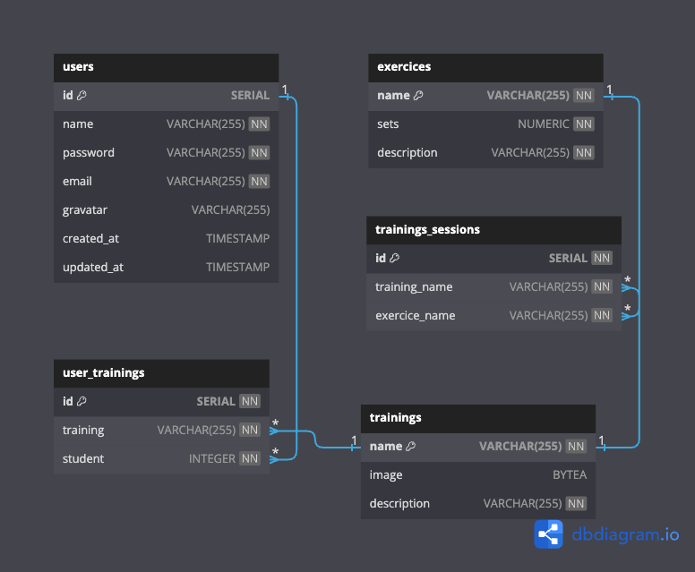

# PEN Training

PEN Trainig is a robust training management application crafted with the PEN technology stack, which integrates PostgreSQL, Express, and Node.js. This web application provides a user-friendly api for creating, managing, and organizing training routines.

**Features**

1. Add, edit, and delete exorcises (CRUD)
2. Add, edit, and delete trainings (CRUD)
3. Add, edit, and delete users (CRUD)
4. Add, edit, and delete users-trainings (CRUD)

**Technologies**

1. PostgreSQL - for database management
2. Express - as the back-end web application framework
3. Node.js - as the JavaScript runtime environment
4. Postman - as a popular API development and testing tool

**Database diagram**



## Installation

You need to have Node.js and npm installed on your PC to run this app. If you don't have it yet, you can download it from here: [Node.js official site](https://nodejs.org/en/download/).

Clone the repository:

```bash
git clone https://github.com/gonchihernandez/training-app-api.git
cd training-app-api
yarn install
yarn start
```

### Next Features in other version

1. Add tests
2. Check architecture
